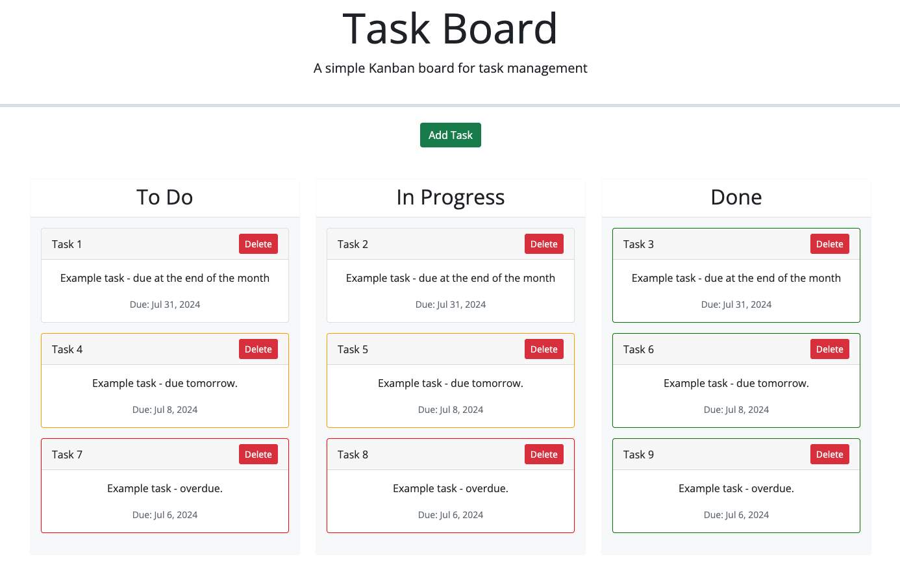

# 05 Third-Party APIs: Task Board

## PROJECT LINKS
### GitHub Repo
[Challenge 5 GitHub Repo](https://github.com/KateHanSta17/challenge-5-bootcamp)
### GitHub Page 
[Deployed Task Board](https://katehansta17.github.io/challenge-5-bootcamp/)
### GitLab Origin
[Third Party API's](https://git.bootcampcontent.com/University-of-Sydney/USYD-VIRT-FSF-PT-05-2024-U-LOLC/-/tree/main/05-Third-Party-APIs/02-Challenge?ref_type=heads)

## HOW IT WORKS
### Add Tasks
- Click "Add Tasks" to open the pop up modal & submission form.


### Date Picker


- Select the appropriate due date and click "save task" to create the new task card.

### Overdue danger border (red)


- Overdue tasks in any lane other than "done" will be RED.

### Immenently due, 2< days - warning border (orange)


- Tasks due in the next 2 days, inclusive of today, in any lane other than "done" will be ORANGE.

### Done (green border by default, regardless of due date)


- Tasks in "done" will be green by default, regardless of due date.

### Card Stacking


- Note that columns will stretch vertically as more cards are added to the lane. Columns should flex back as cards are moved back out.

### WARNING

- <mark>Cards cannot be moved back into "TO DO" column once moved into "in progress" or "done". Card will be deleted and will need to be resubmitted.</mark>

---
---
## The Task

Create a simple task board application that allows a team to manage project tasks by modifying starter code. This app will run in the browser and feature dynamically updated HTML and CSS powered by jQuery.

You'll need to use the [Day.js](https://day.js.org/en/) library to work with dates. Be sure to read the documentation carefully and concentrate on using Day.js in the browser.

## User Story

```md
AS A project team member with multiple tasks to organize
I WANT a task board 
SO THAT I can add individual project tasks, manage their state of progress and track overall project progress accordingly
```

## Acceptance Criteria

```md
GIVEN a task board to manage a project
WHEN I open the task board
THEN the list of project tasks is displayed in columns representing the task progress state (Not Yet Started, In Progress, Completed)
WHEN I view the task board for the project
THEN each task is color coded to indicate whether it is nearing the deadline (yellow) or is overdue (red)
WHEN I click on the button to define a new task
THEN I can enter the title, description and deadline date for the new task into a modal dialog
WHEN I click the save button for that task
THEN the properties for that task are saved in localStorage
WHEN I drag a task to a different progress column
THEN the task's progress state is updated accordingly and will stay in the new column after refreshing
WHEN I click the delete button for a task
THEN the task is removed from the task board and will not be added back after refreshing
WHEN I refresh the page
THEN the saved tasks persist
```

The following animation demonstrates the application functionality:


## Grading Requirements

> **Note**: If a Challenge assignment submission is marked as “0”, it is considered incomplete and will not count towards your graduation requirements. Examples of incomplete submissions include the following:
>
> * A repository that has no code
>
> * A repository that includes a unique name but nothing else
>
> * A repository that includes only a README file but nothing else
>
> * A repository that only includes starter code

This Challenge is graded based on the following criteria:

### Technical Acceptance Criteria: 40%

* Satisfies all of the above acceptance criteria plus the following:

  * Uses the Day.js library to work with dates

### Deployment: 32%

* Application deployed at live URL

* Application loads with no errors

* Application GitHub URL submitted

* GitHub repo contains application code

### Application Quality: 15%

* Application user experience is intuitive and easy to navigate

* Application user interface style is clean and polished

* Application resembles the mock-up functionality provided in the Challenge instructions

### Repository Quality: 13%

* Repository has a unique name

* Repository follows best practices for file structure and naming conventions

* Repository follows best practices for class/id naming conventions, indentation, quality comments, etc.

* Repository contains multiple descriptive commit messages

* Repository contains quality README file with description, screenshot, and link to deployed application

## Review

You are required to submit the following for review:

* The URL of the deployed application

* The URL of the GitHub repository, with a unique name and a README describing the project

- - -
© 2024 edX Boot Camps LLC. Confidential and Proprietary. All Rights Reserved.
